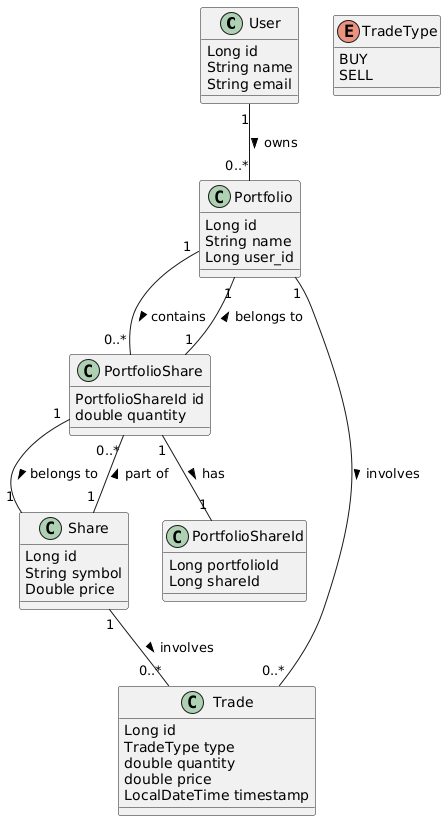

# EvaExchange Case Study 
 
This is a simple stock exchange application that allows users to buy and sell shares. 
The application is built using the Spring framework. Postgresql is used as the database and Data JPA as ORM.


## Features:
- [x] User can register shares amd update the price.
- [x] Users can BUY and SELL shares. 

### Bonus Features:
- [x] Trades are stored in a database. Users can view their trade history or the trade history of a specific share.
- [x] Users can get a summary of their portfolio which includes the total value of their shares, profits and losses from the shares they own.
- [x] DataGeneratorService is implemented to generate random data for testing.
- [x] ShareService has updateSharePrices method that simulates the Real time price with randomized changes every 15 second.
- [x] Shares are only can be bought as a whole number.
- [x] Users can buy shares with share amount or the amount of money they want to spend.
- [x] Users can view the current price of a share.


## API Endpoints
You can test the API using Postman Collection [here](https://elements.getpostman.com/redirect?entityId=37457826-31e72ab4-c75f-455f-be4e-934e6b236498&entityType=collection)
## Entity Diagram

<p align="center">

</p>

## How to run the application
1. **Clone the Repository**
   ```bash
   git clone https://github.com/satas20/EvaExchange.git
   cd EvaExchange
2. Open the project in your IDE
3. Run the application
4. Open Postman and test the API using the Postman Collection

